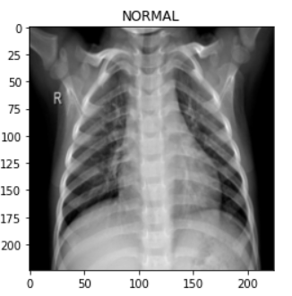
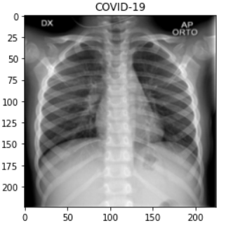
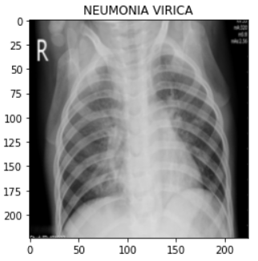
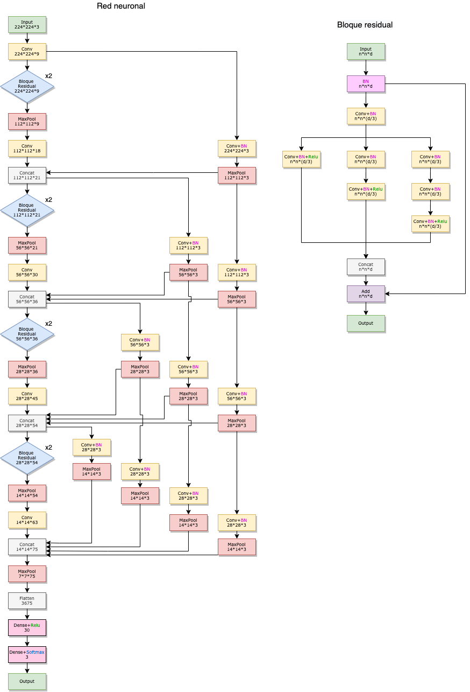
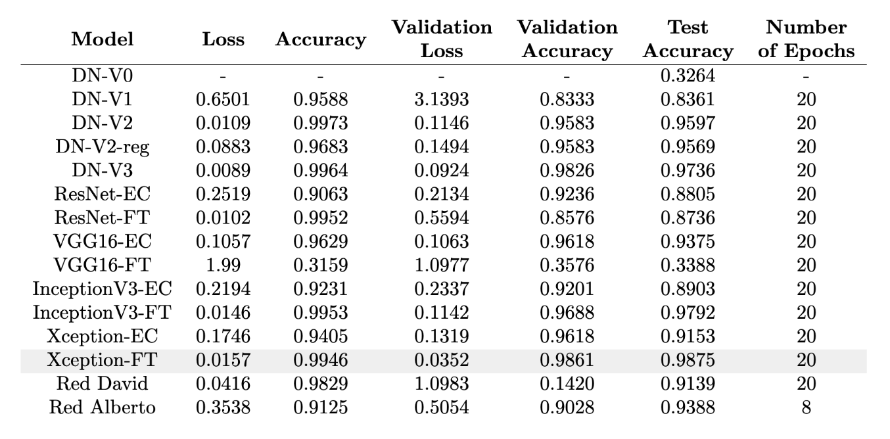
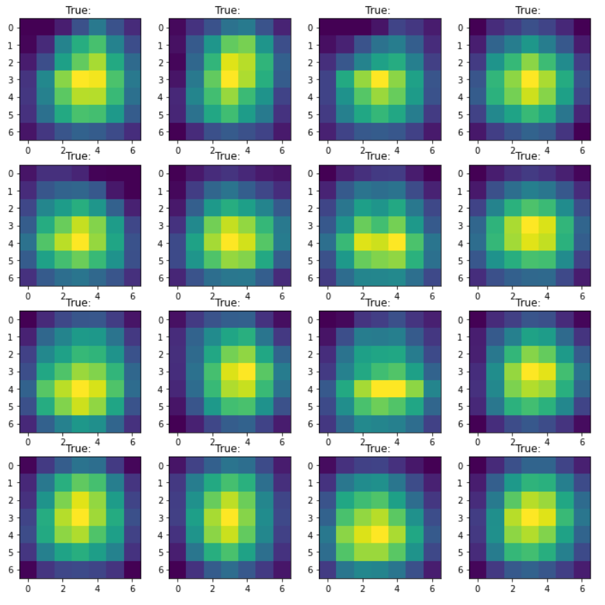
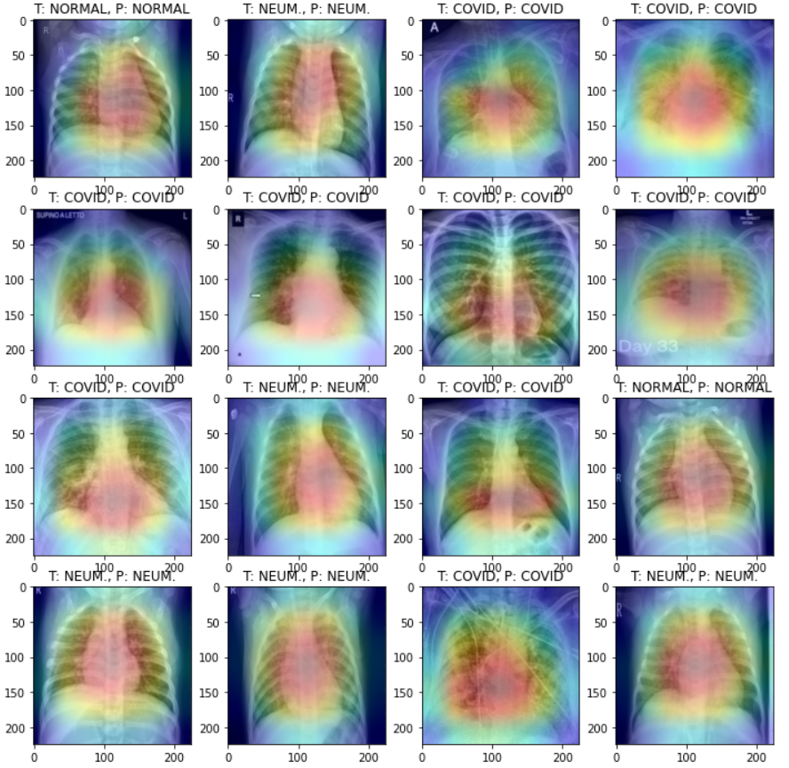

# Classification of Chest X-rays for COVID-19 Detection and Differentiation from Other Viral Pneumonias Using CNNs

![Matplotlib](https://img.shields.io/badge/Matplotlib-%23285479.svg?logo=data:image/svg+xml;base64,PD94bWwgdmVyc2lvbj0iMS4wIiBlbmNvZGluZz0idXRmLTgiPz4KPHN2ZyB2aWV3Qm94PSIwIDAgNTAwIDUwMCIgeG1sbnM9Imh0dHA6Ly93d3cudzMub3JnLzIwMDAvc3ZnIj4KICA8ZGVmcy8+CiAgPHBhdGggZD0iTSAyNDUuMzExIDYuMjc4IEMgNTguMjggOS4yNTIgLTU1LjQwMSAyMTMuNzk3IDQwLjY4NCAzNzQuNDYzIEMgMTM2Ljc3NCA1MzUuMTMgMzcwLjU2MyA1MzEuNDE1IDQ2MS41MDcgMzY3Ljc3NiBDIDU1MC43OTMgMjA3LjEyNCA0MzYuNjQ0IDkuMTk3IDI1My4wMjQgNi4yNzggTCAyNDUuMzExIDYuMjc4IFogTSAyNDUuMzExIDYwLjMzNiBDIDk5Ljg1NSA2My4zMDggMTIuMTU4IDIyMi44MDIgODcuNDU5IDM0Ny40MjMgQyAxNjIuNzU5IDQ3Mi4wNDUgMzQ0LjU3OCA0NjguMzI3IDQxNC43MzcgMzQwLjczNSBDIDQ2My4zNTQgMjUyLjMxMiA0MzMuMDczIDE0OS42NSAzNjAuNjI3IDk2LjQ0MiBDIDMzMC45ODIgNzQuNjY4IDI5NC4yNzUgNjEuMTc4IDI1My4wMjQgNjAuMzM2IEwgMjQ1LjMxMSA2MC4zMzYgWiBNIDI0NS4zMTEgMTE0LjM5MyBDIDE0MS40MzMgMTE3LjM2NiA3OS43MjYgMjMxLjc5OCAxMzQuMjM2IDMyMC4zNjggQyAxODguNzQ0IDQwOC45NDEgMzE4LjU4OSA0MDUuMjI2IDM2Ny45NTkgMzEzLjY4IEMgNDE1LjcwOCAyMjUuMTMzIDM1My41MDMgMTE3LjI2NSAyNTMuMDI0IDExNC4zOTMgTCAyNDUuMzExIDExNC4zOTMgWiBNIDI0NS4zMTEgMTY4LjQ1MSBDIDE4My4wMzEgMTcxLjQyNCAxNDcuMzE5IDI0MC43NzYgMTgxLjAzIDI5My4yODUgQyAyMTQuNzQzIDM0NS43OTQgMjkyLjU5MyAzNDIuMDc5IDMyMS4xNjIgMjg2LjU5NiBDIDM0OC4xOCAyMzQuMTI2IDMxMS45MjQgMTcxLjI2MSAyNTMuMDI0IDE2OC40NTEgTCAyNDUuMzExIDE2OC40NTEgWiBNIDI0NS4zMTEgMjIyLjUwOCBDIDIyNC43NDEgMjI1LjQ4MSAyMTUuMDk4IDI0OS42MjkgMjI3Ljk1NCAyNjUuOTc4IEMgMjQwLjgwOSAyODIuMzI2IDI2Ni41MjQgMjc4LjYxMiAyNzQuMjM3IDI1OS4yOSBDIDI4MC43MjUgMjQzLjA0NSAyNzAuMzE5IDIyNS4wMDYgMjUzLjAyNCAyMjIuNTA4IEwgMjQ1LjMxMSAyMjIuNTA4IFogTSA0OTIuMTU5IDI0OS41MzcgTCA2LjE3NiAyNDkuNTM3IE0gNDIyLjczMiA3NS43OCBMIDc1LjYwMyA0MjMuMjkzIE0gNDIyLjczMiA0MjMuMjkzIEwgNzUuNjAzIDc1Ljc4IE0gMjQ5LjE2NyA2LjI3OCBMIDI0OS4xNjcgNDkyLjc5NSIgc3R5bGU9InBhaW50LW9yZGVyOiBzdHJva2UgbWFya2VyczsgZmlsbC1ydWxlOiBldmVub2RkOyBmaWxsOiByZ2IoMjU1LCAyNTUsIDI1NSk7IGZpbGwtb3BhY2l0eTogMDsgc3Ryb2tlLXdpZHRoOiAxMHB4OyBzdHJva2U6IHJnYigyNTUsIDI1NSwgMjU1KTsiLz4KICA8cGF0aCBkPSJNIDE5NS4xNjkgMzMuMzA3IEwgMTE4LjAzIDcxLjkyIEwgMzgwLjMwNSA0MjcuMTU0IEwgNDE4Ljg3NSAzODguNTQyIEwgMjQ5LjE2NyAyNDkuNTM3IEwgMTk1LjE2OSAzMy4zMDcgWiIgc3R5bGU9ImZpbGw6IHJnYigyNTUsIDI1NSwgMjU1KTsiLz4KICA8cGF0aCBkPSJNIDY3Ljg4OCAxOTUuNDggTCA2Ny44ODggMzAzLjU5NCBMIDI0OS4xNjcgMjQ5LjUzNyBMIDY3Ljg4OCAxOTUuNDggWiIgc3R5bGU9ImZpbGw6IHJnYigyNTUsIDI1NSwgMjU1KTsiLz4KICA8cGF0aCBkPSJNIDI0OS4xNjcgMjQ5LjUzNyBMIDI3Mi4zMDkgMzg0LjY4IEwgMjI2LjAyNSAzODQuNjggTCAyNDkuMTY3IDI0OS41MzcgWiIgc3R5bGU9ImZpbGw6IHJnYigyNTUsIDI1NSwgMjU1KTsiLz4KICA8cGF0aCBkPSJNIDI0OS4xNjcgMjQ5LjUzNyBMIDI5OS4zMDkgOTUuMDg2IEwgMzM0LjAyMSAxMTQuMzkzIEwgMjQ5LjE2NyAyNDkuNTM3IFoiIHN0eWxlPSJmaWxsOiByZ2IoMjU1LCAyNTUsIDI1NSk7Ii8+CiAgPHBhdGggZD0iTSAyNDkuMTY3IDI0OS41MzcgTCAzMDMuMTY1IDIyNi4zNjkgTCAzMDcuMDIyIDI0MS44MTQgTCAyNDkuMTY3IDI0OS41MzcgWiBNIDI0OS4xNjcgMjQ5LjUzNyBMIDE0OC44ODUgMjk5LjczMyBMIDE2MC40NTcgMzE1LjE3OCBMIDI0OS4xNjcgMjQ5LjUzNyBaIiBzdHlsZT0iZmlsbDogcmdiKDI1NSwgMjU1LCAyNTUpOyIvPgo8L3N2Zz4=&logoColor=white)

This repository contains the work done on the implementation and testing of a method that allows for the classification of posteroanterior chest X-rays with the goal of detecting COVID-19-infected lungs and distinguishing them from other types of viral pneumonias, using Computer Vision and Machine Learning techniques. It is based on Convolutional Neural Networks pre-trained with non-medical datasets (Imagenet challenge) and user-defined CNNs. You can read the project report [here](MasterThesis.pdf).

## Abstract
The use of simple chest X-rays for the detection of thoracic pathologies is a highly effective technique and is considered the primary examination to perform due to the large amount of information it can provide. Clinically, pneumonia is defined as lung consolidation on a chest X-ray along with clinical signs and symptoms of respiratory infection (fever, cough, and expectoration). Lung consolidation is radiologically reflected by increased lung opacity due to the accumulation of substances denser than air. COVID-19 viral pneumonia has been a disease that, since the first case was detected in December 2019, has spread globally with a high rate of contagion, being declared a pandemic in March 2020. Since then, it has caused the greatest health crisis experienced globally in modern times, making pandemic control an urgent priority. Chest X-rays allow for the diagnosis of the disease and a better understanding of how it affects the body, which is why we consider their study to be highly relevant. However, it is possible to confuse viral pneumonia caused by COVID-19 with other viral pneumonias caused by different pathogens.

Therefore, with our study, we aim to develop an effective method for classifying posteroanterior chest X-rays using pre-trained Convolutional Neural Networks, which can distinguish patients with healthy lungs from those with viral pneumonia. Additionally, it should be able to differentiate between viral pneumonias, specifically focusing on whether the pathogen is COVID-19 or not, to improve diagnosis, study, and understanding of this disease. These pre-trained networks were trained on non-medical image datasets (Imagenet). Furthermore, we also experimented with creating our own CNNs for this same purpose.

The best method explored is able to differentiate between healthy lungs (normal), lungs affected by COVID-19, and lungs affected by other types of viral pneumonia with 98.75% accuracy. Additionally, we can highlight the discriminative regions identified by the network where the most characteristic patterns for each class appear. This can help to better understand how COVID-19 manifests in X-rays and the areas where it differs most from other viral pneumonias.

The project was presented as a final project in our Computer Vision subject, receiving a grade of high honors.

## Experimental setup
The dataset used can be found [here](https://www.kaggle.com/tawsifurrahman/covid19-radiography-database). It contains posteroanterior chest X-ray images of healthy lungs, lungs affected by COVID-19, and lungs affected by other viral pneumonias. A random permutation was performed, selecting 80% for training and 20% for testing. Within the training set, a 10% validation split was used during training.

     
    
     

Multiple networks were tested, some pre-trained with the Imagenet dataset, and others defined and trained from scratch. This is the schematic of the network developed by David, featuring residual blocks and dense connections:

 

The results obtained were as follows (Models ending in 'EC' are those where the base model was used as a feature extractor, and a small dense model was trained using those features with data augmentation. Models ending in 'FT' refer to performing Fine Tuning on the original model, allowing all the network's weights to be adjusted while only modifying the last layer).

 

Additionally, heatmaps (areas of the image most relevant for making the final classification) have been calculated and visualized for each image to be classified, allowing us to see which areas are the most significant within an image for two models, including the Xception-FT model, which yielded the best results in testing. Here, the heatmaps are shown for the last convolutional layer, both the actual heatmaps and those overlaid on the original images, for the first 16 images in the test set:

     
    

## Additional info
- **Authors**: David Villar Martos, Alberto Luque Infante
- **Contributors**: David Villar Martos, Alberto Luque Infante
